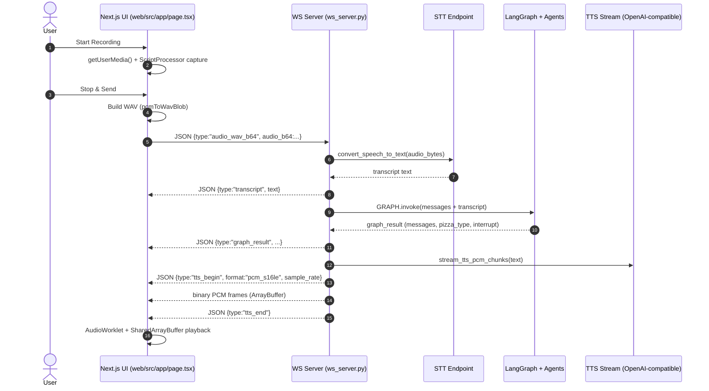

## Pizza Order Voice Flow (Start Recording → Stop & Send)

This diagram focuses on the main voice path: the user records audio in the browser, the UI sends the WAV to the Python WebSocket server, the server runs STT + the agent graph, then streams TTS audio back to the browser for playback.

