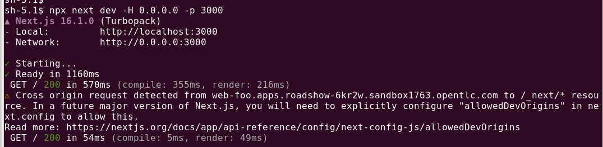

# Pizza Shop Demo

Putting it all together - Running the demo yourself.

[](https://youtu.be/d_Ba9Io6AgI)

## Server Side

In your voice notebook.

Install requirements.

```bash
uv pip install -r requirement.txt
```

Run web socket server in a notebook shell.

```bash
python ws_server.py
```


## Client Side

```bash
cd web
```

Install requirements.

```bash
npm i
```

Build a production version.

```bash
npm run build
```

Run the Web UI in a notebook shell.

```bash
npx next dev -H 0.0.0.0 -p 3000
```



Apply client side routing.

```bash
oc apply -f web-ui-routing.yaml
```

Browse to the Web UI Route.

## Testing using the Web UI

Connect to the web socket using the notebook proxy.

```bash
wss://data-science-gateway.apps.$CLUSTER_DOMAIN/notebook/agent-demo/voice/proxy/8765/admin
```


Quick test (no mic needed).


Start a conversation.


